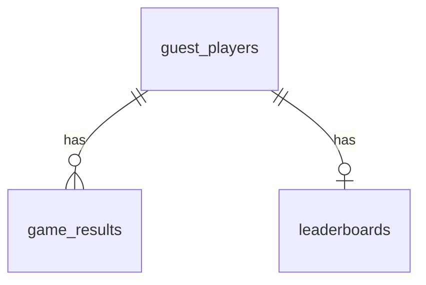

# Database Schema

Schema Prisma: `prisma/schema.prisma`  
Database: PostgreSQL 16

## Enum

| Enum                 | Values           |
| -------------------- | ---------------- |
| `GameId`             | `FRULOOP`        |
| `DevicePlatform`     | `IOS`, `ANDROID` |
| `NotificationLocale` | `EN`, `VI`       |

## Tables

### `guest_players`

| Column               | Type                  | Notes                  |
| -------------------- | --------------------- | ---------------------- |
| `id`                 | `TEXT`                | PK                     |
| `gameId`             | `GameId`              | scope by game          |
| `name`               | `TEXT?`               | display name           |
| `authTokenHash`      | `TEXT`                | unique auth token hash |
| `fcmToken`           | `TEXT?`               | unique FCM token       |
| `devicePlatform`     | `DevicePlatform?`     | IOS/ANDROID            |
| `notificationLocale` | `NotificationLocale?` | EN/VI                  |
| `createdAt`          | `TIMESTAMP`           | creation timestamp     |

Constraints:

- unique(`authTokenHash`)
- unique(`fcmToken`)
- unique(`gameId`, `id`) (FK target)

### `game_results` (range partitioned by year)

| Column           | Type         | Notes                            |
| ---------------- | ------------ | -------------------------------- |
| `id`             | `TEXT`       | part of PK                       |
| `createdAt`      | `TIMESTAMP`  | part of PK + partition key       |
| `gameId`         | `GameId`     |                                  |
| `guestId`        | `TEXT`       | FK -> `guest_players(gameId,id)` |
| `clientResultId` | `TEXT`       | client dedup key                 |
| `score`          | `INTEGER`    |                                  |
| `signature`      | `TEXT`       | HMAC verified hash               |
| `metadata`       | `JSONB?`     | optional                         |
| `playedAt`       | `TIMESTAMP?` | optional                         |

Indexes:

- (`gameId`, `guestId`, `clientResultId`)
- (`gameId`, `guestId`)
- (`gameId`, `createdAt`)

### `leaderboards`

| Column      | Type        | Notes        |
| ----------- | ----------- | ------------ |
| `gameId`    | `GameId`    | PK part      |
| `guestId`   | `TEXT`      | PK part + FK |
| `bestScore` | `INTEGER`   |              |
| `updatedAt` | `TIMESTAMP` | auto updated |

Index:

- (`gameId`, `bestScore` DESC)

## ER Diagram

## Notes

- Chỉ có 3 bảng nghiệp vụ chính: `guest_players`, `game_results`, `leaderboards`.
- Không còn `guest_device_tokens` và `notification_outbox`.
- `game_results` partition tạo bằng custom SQL migration + maintenance job.
