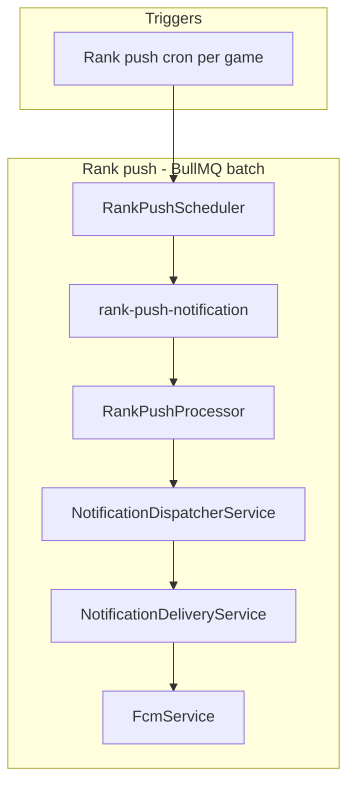

# Push Notifications

Push dùng FCM (`firebase-admin`). Scheduled rank push (`rankPushCron`) batch qua BullMQ.  
Push là optional: thiếu `FIREBASE_*` thì server vẫn chạy, chỉ skip send.

## Kiến trúc hiện tại

Không dùng DB outbox.

## Điều kiện gửi

Notification được gửi khi:

1. Guest có `fcmToken` trong `guest_players`
2. Scheduled rank push (`rank_push`): game có `rankPushCron` trong `GAME_CONFIG` và guest có rank trên leaderboard

## Notification types

- `rank_push`

Route hiện dùng: `Leaderboard`.

Rank sau submit score được trả trong `POST /api/results` (`rank`, `bestScore`) — client hiển thị in-app, không push.

## Scheduled rank push (`rankPushCron`)

- Cron: khai báo per-game trong `GAME_CONFIG.rankPushCron` (timezone `Asia/Ho_Chi_Minh`)
- FRULOOP mặc định: `0 9 * * 6`
- Batch size: `500` (cursor pagination theo `gameId`)

## Invalid token handling

FCM lỗi:

- `messaging/registration-token-not-registered`
- `messaging/invalid-registration-token`

→ backend clear token device trên `guest_players` (set `fcmToken/devicePlatform/notificationLocale` về `null`).

## Files liên quan

- `src/features/notifications/notification-delivery.service.ts`
- `src/features/notifications/notification-dispatcher.service.ts`
- `src/features/notifications/jobs/rank-push.job.ts`
- `src/features/notifications/jobs/rank-push.scheduler.ts`
- `src/features/notifications/fcm.service.ts`
