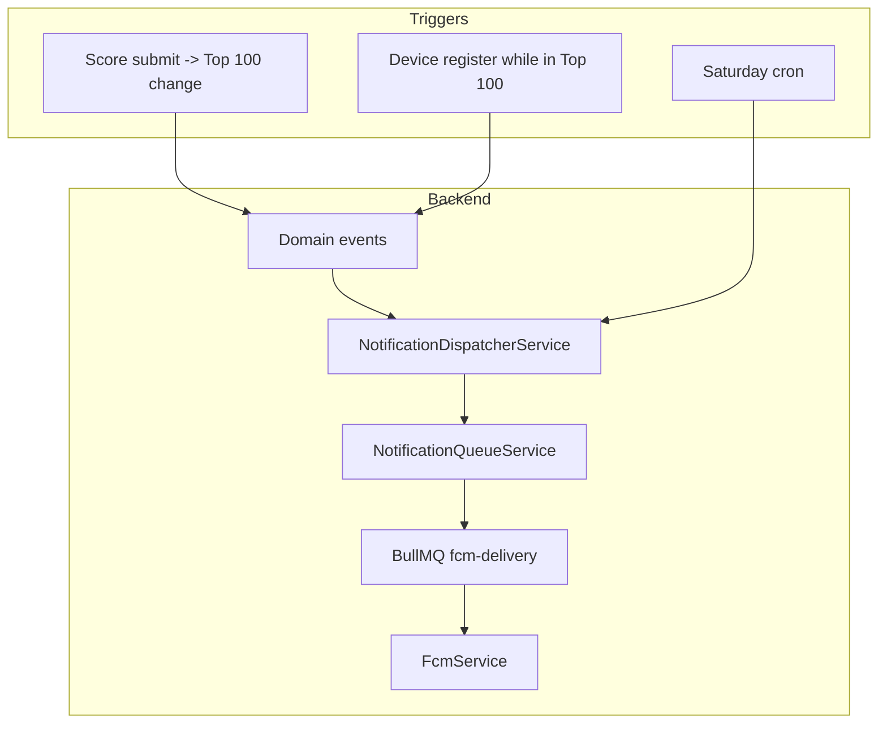

# Push Notifications

Push dùng FCM (`firebase-admin`) và BullMQ.  
Push là optional: thiếu `FIREBASE_*` thì server vẫn chạy, chỉ skip send.

## Kiến trúc hiện tại

Không dùng DB outbox.

## Điều kiện enqueue

Notification được enqueue khi:

1. Guest không mute (`notification:muted:{gameId}:{guestId}` không tồn tại)
2. Guest có `fcmToken` trong `guest_players`
3. Với Saturday rank: guest có rank trên leaderboard

## Notification types

- `top_100_entered`
- `top_100_exited`
- `saturday_rank`

Route hiện dùng: `Leaderboard`.

## Saturday rank

- Cron: `0 9 * * 6` (Asia/Ho_Chi_Minh)
- Batch size: `500`
- Dedupe theo tuần bằng `jobId` ổn định: `{gameId}:{guestId}:saturday_rank:{ISO-week}`

## Invalid token handling

FCM lỗi:

- `messaging/registration-token-not-registered`
- `messaging/invalid-registration-token`

-> backend clear token device trên `guest_players` (set `fcmToken/devicePlatform/notificationLocale` về `null`).

## Files liên quan

- `src/features/notifications/notification-queue.service.ts`
- `src/features/notifications/notification-dispatcher.service.ts`
- `src/features/notifications/jobs/fcm-delivery.job.ts`
- `src/features/notifications/jobs/saturday-rank.job.ts`
- `src/features/notifications/fcm.service.ts`
