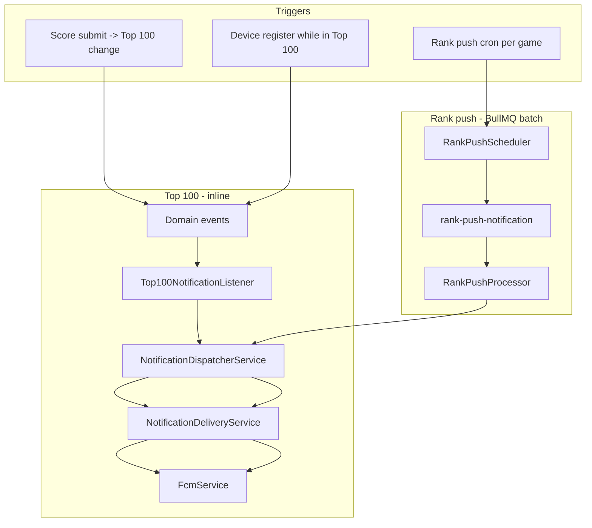

# Push Notifications

Push dùng FCM (`firebase-admin`). Top 100 gửi inline; scheduled rank push (`rankPushCron`) batch qua BullMQ.  
Push là optional: thiếu `FIREBASE_*` thì server vẫn chạy, chỉ skip send.

## Kiến trúc hiện tại

Không dùng DB outbox.

## Điều kiện gửi

Notification được gửi khi:

1. Guest không mute (`notification:muted:{gameId}:{guestId}` không tồn tại)
2. Guest có `fcmToken` trong `guest_players`
3. Scheduled rank push (`rank_push`): game có `rankPushCron` trong `GAME_CONFIG` và guest có rank trên leaderboard

## Notification types

- `top_100_entered`
- `top_100_exited`
- `rank_push`

Route hiện dùng: `Leaderboard`.

## Top 100 state (`top100EnterNotified`)

| Sự kiện                                  | `top100EnterNotified`                                                                              |
| ---------------------------------------- | -------------------------------------------------------------------------------------------------- |
| Vào Top 100 (score hoặc device register) | Giữ `false` cho đến khi FCM `top_100_entered` gửi thành công → `confirmTop100Entered()` set `true` |
| Rời Top 100 (tự rớt hoặc bị đẩy)         | Set `false` trước khi emit `PlayerExitedTop100Event`                                               |
| Ở trong Top 100 (cải thiện rank)         | Không đổi flag; chỉ `confirmTop100Entered()` set `true` sau FCM thành công                         |

`NotificationDeliveryService.deliver()` trả `result.success` từ `FcmService` — listener chỉ confirm enter khi `deliver()` trả `true`. Nếu chưa có FCM token hoặc gửi fail, `maybeNotifyTop100OnDeviceRegister()` vẫn retry khi user đăng ký device sau.

## Scheduled rank push (`rankPushCron`)

- Cron: khai báo per-game trong `GAME_CONFIG.rankPushCron` (timezone `Asia/Ho_Chi_Minh`)
- FRULOOP mặc định: `0 9 * * 6`
- Batch size: `500` (cursor pagination theo `gameId`)

## Invalid token handling

FCM lỗi:

- `messaging/registration-token-not-registered`
- `messaging/invalid-registration-token`

→ backend clear token device trên `guest_players` (set `fcmToken/devicePlatform/notificationLocale` về `null`).

## Files liên quan

- `src/features/notifications/notification-delivery.service.ts`
- `src/features/notifications/notification-dispatcher.service.ts`
- `src/features/notifications/top100-notification.listener.ts`
- `src/features/notifications/jobs/rank-push.job.ts`
- `src/features/notifications/jobs/rank-push.scheduler.ts`
- `src/features/notifications/fcm.service.ts`
