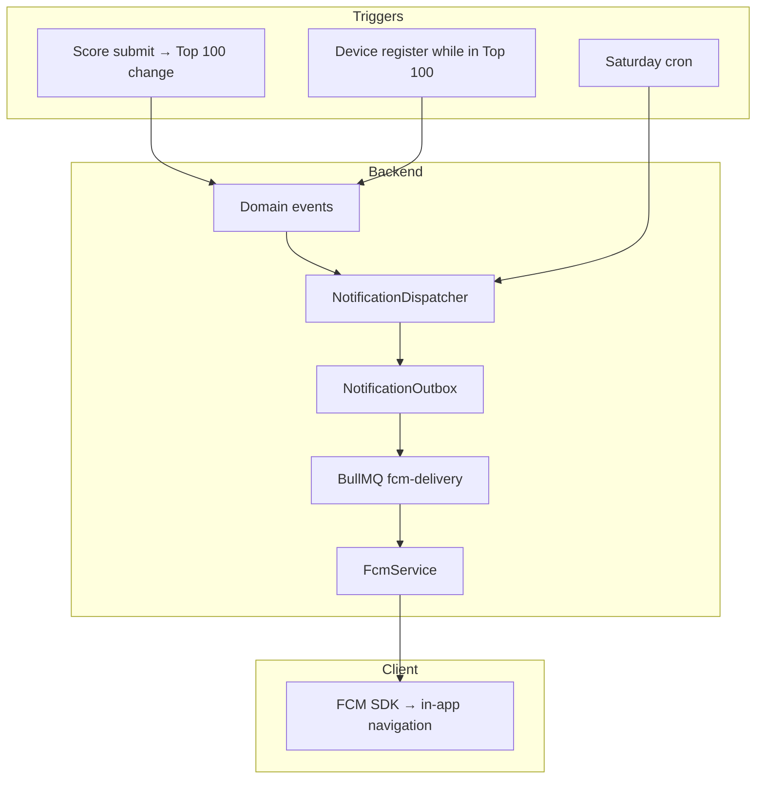

# Push Notifications

Hệ thống push notification dùng **FCM** (Firebase Cloud Messaging) qua `firebase-admin`. Push là **optional** — thiếu biến `FIREBASE_*` thì server vẫn chạy, device APIs vẫn hoạt động, chỉ không gửi được push.

Client setup: `game-starter-kit/documents/setup/firebase-native.md`
Device APIs: [apis/devices.md](../apis/devices.md)
Firebase env: [setup/environment-variables.md](../setup/environment-variables.md)

## Kiến trúc



**Outbox pattern:** Mọi push được ghi vào `notification_outbox` trước, rồi xử lý async qua BullMQ. Đảm bảo retry, idempotency, và không block request chính.

## Điều kiện gửi push

Push chỉ được enqueue khi **tất cả** điều kiện sau thỏa:

1. Guest **không** bị mute (`notification:muted:{gameId}:{guestId}` không tồn tại)
2. Có device token `ACTIVE` trong `guest_device_tokens`
3. Với Saturday rank: guest phải **có rank** trên leaderboard

Nếu không thỏa → `enqueue()` trả `null`, không tạo outbox row.

## Notification types

| `type` (FCM data) | Trigger | `route` | Nội dung |
| ----------------- | ------- | ------- | -------- |
| `top_100_entered` | Vào Top 100 sau submit | `Leaderboard` | EN/VI congratulation |
| `top_100_exited` | Rời Top 100 (kể cả bị đẩy) | `Leaderboard` | EN/VI encourage return |
| `saturday_rank` | Cron thứ 7 9:00 VN | `Leaderboard` | `Hiện bạn đang đứng hạng #{{rank}}` |

Localized content: `NOTIFICATION_I18N` trong `src/common/constants/notification.constants.ts`.

Locale resolve: device record `locale` (`EN`/`VI`) → code `en`/`vi`.

## FCM payload

```json
{
  "notification": {
    "title": "Chúc mừng!",
    "body": "Bạn đã lọt Top 100."
  },
  "data": {
    "type": "top_100_entered",
    "route": "Leaderboard"
  },
  "android": {
    "priority": "high",
    "notification": { "channelId": "game_alerts" }
  },
  "apns": {
    "payload": { "aps": { "sound": "default" } }
  }
}
```

- Client dùng `data.type` + `data.route` cho **in-app navigation** — không phải deeplink URL.
- Android channel `game_alerts` phải khớp channel client tạo trong game-starter-kit.

## Top 100 flow

### 1. Score submit

`ResultsService` → `LeaderboardRankTrackerService.onScoreUpdated()`:

1. Lấy rank trước/sau khi cập nhật Redis
2. Xác định guest tại rank 100 trước khi update (để detect displaced player)
3. Emit `PlayerEnteredTop100Event` hoặc `PlayerExitedTop100Event`
4. Cập nhật `guest_players.inTop100`

### 2. Event listener

`Top100NotificationListener`:

- `PlayerEnteredTop100Event` → `sendTop100Entered()` → confirm `inTop100 = true` nếu enqueue thành công
- `PlayerExitedTop100Event` → `sendTop100Exited()`

### 3. Device register catch-up

Khi guest đăng ký device (`POST /api/devices`) mà đã trong Top 100 nhưng chưa nhận push (ví dụ chưa có token trước đó):

`DeviceTokenService.registerDevice()` → `maybeNotifyTop100OnDeviceRegister()` → emit `PlayerEnteredTop100Event` nếu rank ≤ 100 và `inTop100 = false`.

## Saturday rank broadcast

Cron `0 9 * * 6` (Asia/Ho_Chi_Minh) → BullMQ batch qua active device tokens.

- Chỉ gửi guest **có rank** (resolve qua Redis, fallback DB)
- Idempotency key: `{gameId}:{guestId}:saturday_rank:{ISO-week}` — mỗi guest tối đa một push/tuần
- Batch size: 500 devices/batch

Chi tiết cron: [schedule/fcm-notification-jobs.md](../schedule/fcm-notification-jobs.md).

## Outbox delivery lifecycle

```
enqueue() → PENDING → BullMQ job → claim PROCESSING
  → FCM send success → SENT
  → muted / no token → SKIPPED
  → invalid FCM token → mark device INVALID + SKIPPED
  → transient error → PENDING (backoff) → retry
  → max attempts (5) → DEAD
```

**Backoff schedule** (ms): 30s, 60s, 5m, 15m, 60m

**Stale recovery:** Row `PROCESSING` quá 10 phút → reset về `PENDING` (cron retry mỗi 5 phút).

## Mute / preferences

| Hành động | Redis mute key | DB device status |
| --------- | -------------- | ---------------- |
| `PATCH /devices/preferences { enabled: false }` | SET | không đổi |
| `PATCH /devices/preferences { enabled: true }` | DEL | không đổi |
| `DELETE /devices` | SET | `INACTIVE` |
| `POST /devices` | DEL | `ACTIVE` |

Unregister và mute đều chặn push mới; register/update bật lại.

## Invalid token handling

FCM errors:

- `messaging/registration-token-not-registered`
- `messaging/invalid-registration-token`

→ Đánh dấu device token `INVALID`, outbox row `SKIPPED`.

Client cần gọi lại `POST /api/devices` với token mới sau khi FCM refresh.

## Kiểm tra / debug

```bash
# Log khi start
# "Firebase Admin SDK initialized" → FCM enabled
# "Firebase is not configured — push notifications are disabled" → FCM off

# DB
SELECT id, type, status, attempts, "lastError", "scheduledAt"
FROM notification_outbox
ORDER BY "createdAt" DESC
LIMIT 20;

SELECT "guestId", token, status, locale
FROM guest_device_tokens
WHERE status = 'ACTIVE';
```

## Files liên quan

| File | Vai trò |
| ---- | ------- |
| `fcm.service.ts` | Firebase Admin init + send |
| `notification-outbox.service.ts` | Enqueue, deliver, retry |
| `notification-dispatcher.service.ts` | API gọi từ events/cron |
| `top100-notification.listener.ts` | Event → dispatcher |
| `leaderboard-rank-tracker.service.ts` | Detect Top 100 changes |
| `jobs/saturday-rank.job.ts` | Saturday batch processor |
| `jobs/fcm-delivery.job.ts` | BullMQ FCM worker |
| `jobs/fcm-retry.scheduler.ts` | Cron re-enqueue pending |
| `notification.constants.ts` | Types, i18n, cron, backoff |
