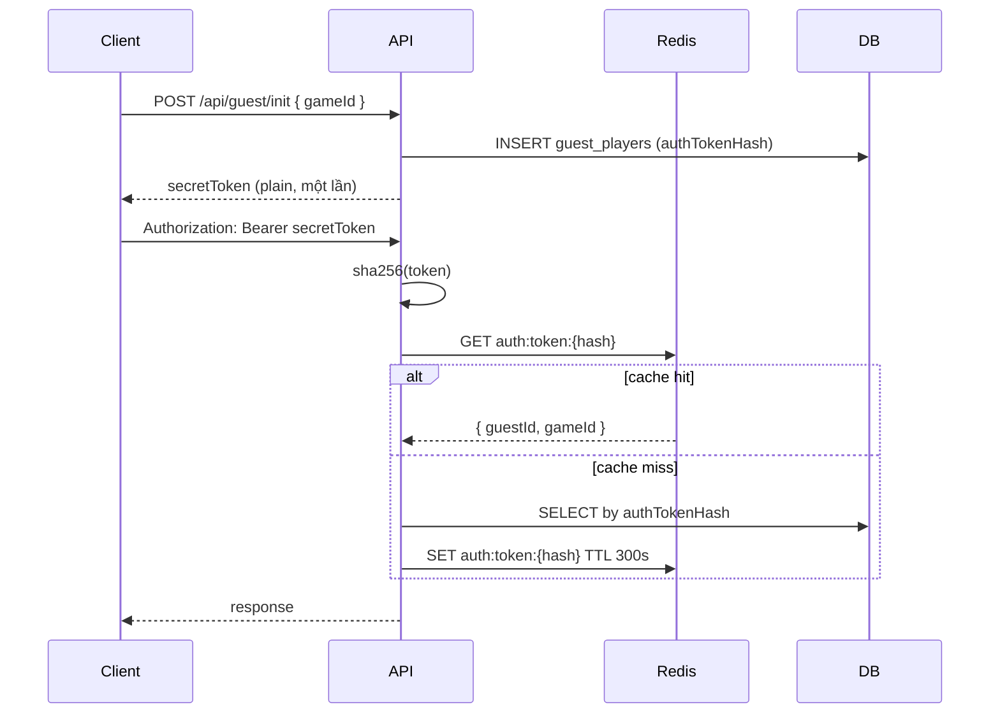
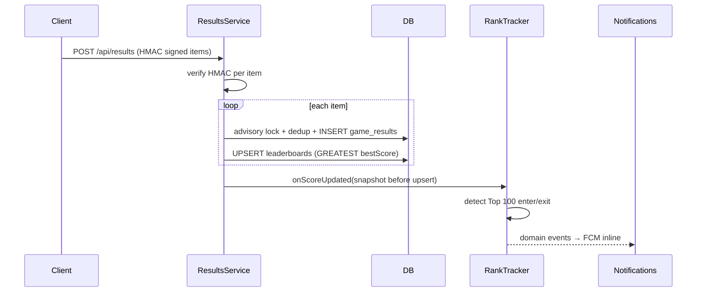
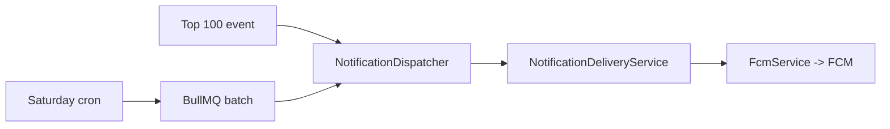

# Kiến trúc tổng quan

Game API là backend **Leaderboard-as-a-Service** cho game casual/hyper-casual. Người chơi chỉ có guest token — không đăng ký tài khoản.

## Tech stack

| Thành phần         | Công nghệ                                   |
| ------------------ | ------------------------------------------- |
| Framework          | NestJS 11                                   |
| ORM                | Prisma 6                                    |
| Database           | PostgreSQL 16 (partitioned `game_results`)  |
| Cache / rate limit | Redis 8 (auth cache, rate limit, mute flag) |
| Queue              | BullMQ (`@nestjs/bullmq`)                   |
| Push               | firebase-admin (FCM, optional)              |
| Scheduler          | `@nestjs/schedule`                          |

Global prefix: `/api`. Path alias: `@/*` → `src/*`.

## Module layout

```
src/
├── main.ts                 # Bootstrap, pipes, filters, interceptors
├── app.module.ts
├── common/                 # Guards, decorators, constants, utils
├── features/
│   ├── guest/              # Init + display name
│   ├── results/            # Batch submit, HMAC, dedup
│   │   └── results-data.module.ts  # Shared ResultsRepository
│   ├── leaderboard/        # Query + rank tracker
│   └── notifications/      # FCM, device tokens, cron jobs
├── infra/
│   ├── prisma/
│   ├── redis/
│   └── maintenance/        # Partition cron
└── domain/
    └── events/             # Top 100 domain events
```

## Luồng xác thực guest



- Token **vĩnh viễn** — không rotate, không TTL.
- Mỗi guest gắn với một `gameId` cố định.
- Chi tiết Redis: [redis-keys.md](./redis-keys.md).

## Luồng gửi kết quả



- HMAC payload: `${gameId}|${guestId}|${clientResultId}|${score}|${playedAt || ''}`
- `replaySecret` khai báo trong `GAME_CONFIG` (source code), không đọc từ env.
- Dedup: PostgreSQL advisory lock (không có UNIQUE global trên partitioned table).
- Chi tiết API: [apis/results.md](../apis/results.md).

## Luồng leaderboard

1. Client gọi `GET /api/leaderboards?gameId=...&page=...&limit=...&guestId=...`
2. Server query PostgreSQL `leaderboards` (ORDER BY `bestScore` DESC, `guestId` ASC).
3. Tùy chọn `guestId` → trả `self.rank` và `self.bestScore` (đếm số score cao hơn + 1).

Chi tiết: [apis/leaderboard.md](../apis/leaderboard.md).

## Luồng push notification



Ba loại push:

| Type        | Trigger                                  |
| ----------- | ---------------------------------------- |
| `rank_push` | Cron per-game `GAME_CONFIG.rankPushCron` |

Chi tiết: [notifications.md](./notifications.md), [schedule/fcm-notification-jobs.md](../schedule/fcm-notification-jobs.md).

## Response envelope

**Thành công** — `ResponseInterceptor` bọc tất cả response:

```json
{
  "success": true,
  "statusCode": 200,
  "message": "Data retrieved successfully",
  "data": {},
  "timestamp": "2026-06-27T12:00:00.000Z",
  "path": "/api/..."
}
```

**Lỗi** — `HttpExceptionFilter`:

```json
{
  "success": false,
  "statusCode": 400,
  "message": "Validation failed",
  "error": "Bad Request",
  "errors": [{ "field": "...", "constraint": "...", "message": "...", "value": "..." }],
  "timestamp": "...",
  "path": "/api/..."
}
```

Validation lỗi: HTTP 400, `message: "Validation failed"`, mảng `errors`.
Stack trace chỉ có khi `NODE_ENV !== 'production'`.

## Rate limiting

Dùng Redis counter sliding window (60 giây). Guard: `RateLimitGuard` + decorator `@RateLimit`.

| Endpoint            | Limit          | Key source | Redis prefix   |
| ------------------- | -------------- | ---------- | -------------- |
| `POST /guest/init`  | 5/min          | IP         | `rate:init:`   |
| `PATCH /guest/name` | 10/min         | guest      | `rate:name:`   |
| `POST /results`     | 20/min         | guest      | `rate:result:` |
| `GET /leaderboards` | 30/min         | IP         | `rate:lb:`     |
| `/devices/*`        | 10/min         | guest      | `rate:device:` |
| `GET /health`       | không giới hạn | —          | —              |

## Bảo mật

- `helmet` — security headers (CSP chỉ production)
- `compression` — gzip (threshold 1024 bytes)
- HMAC so sánh bằng `timingSafeEqual`
- Startup guard `validateGameSecrets()` — chặn app nếu `replaySecret` sai format
- Không log `replaySecret`, `secretToken` raw, `authTokenHash`
- CORS: cho phép mọi origin + credentials (production nên hạn chế qua reverse proxy)

## Scheduled maintenance

| Job           | Schedule                        | Mô tả                             |
| ------------- | ------------------------------- | --------------------------------- |
| Partition     | `0 3 1 * *` + startup           | Tạo `game_results_<YYYY>`         |
| Saturday rank | Per-game `rankPushCron` (VN TZ) | Scheduled rank push (`rank_push`) |

Xem [schedule/](../schedule/).

## Games

Danh sách game khai báo trong source (`GameId` enum + `GAME_CONFIG`), không có bảng `games` trong DB. Hướng dẫn thêm game: [setup/adding-new-game.md](../setup/adding-new-game.md).
