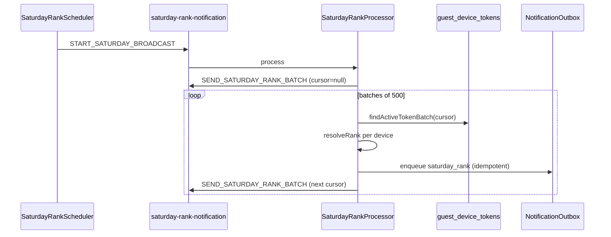

# FCM Notification Scheduled Jobs

Tài liệu mô tả cron jobs và BullMQ workers cho push notification. Source chính: `src/features/notifications/`.

## Tổng quan

| Job | Schedule | Timezone | File |
| --- | -------- | -------- | ---- |
| Saturday rank broadcast | `0 9 * * 6` | `Asia/Ho_Chi_Minh` | `jobs/saturday-rank.scheduler.ts` |
| FCM delivery retry | `*/5 * * * *` | `Asia/Ho_Chi_Minh` | `jobs/fcm-retry.scheduler.ts` |
| Partition maintenance | `0 3 1 * *` | server local | `infra/maintenance/maintenance.service.ts` |

Constants: `NOTIFICATION_CRON` trong `src/common/constants/notification.constants.ts`.

---

## Saturday rank broadcast

**Schedule:** `0 9 * * 6` — 9:00 sáng thứ Bảy (Asia/Ho_Chi_Minh)

**Purpose:**

- Gửi push `saturday_rank` cho mọi guest có device token `ACTIVE` **và có rank** trên leaderboard.
- Nhắc người chơi thứ hạng hiện tại hàng tuần.

### Flow



### Job names (BullMQ queue `saturday-rank-notification`)

| Job | Payload | Hành động |
| --- | ------- | --------- |
| `start-saturday-broadcast` | `{}` | Enqueue batch job đầu tiên |
| `send-saturday-rank-batch` | `{ cursor?: string }` | Xử lý 500 devices, chain batch tiếp |

### Idempotency

Key: `{gameId}:{guestId}:saturday_rank:{YYYY-Www}` (ISO week).

Mỗi guest tối đa **một** Saturday push mỗi tuần — duplicate enqueue → reuse existing outbox row.

### Batch size

`SATURDAY_RANK_BATCH_SIZE = 500` — cursor pagination theo `device.id`.

---

## FCM delivery retry

**Schedule:** `*/5 * * * *` — mỗi 5 phút (Asia/Ho_Chi_Minh)

**Purpose:**

- Re-enqueue outbox rows `PENDING` đã đến `scheduledAt`.
- Recover rows `PROCESSING` stale (> 10 phút).

### Operation

1. `recoverStaleProcessing()` — reset `PROCESSING` quá `FCM_PROCESSING_STALE_MS` (10 phút) về `PENDING`.
2. `findRetryableBatch(100)` — lấy tối đa 100 rows cần retry.
3. Enqueue BullMQ job `deliver-fcm` cho mỗi row.

### FCM delivery worker

Queue: `fcm-delivery`
Job: `deliver-fcm` với payload `{ outboxId }`

Processor: `FcmDeliveryProcessor` → `NotificationOutboxService.deliver(outboxId)`.

Delivery logic:

- Claim row → `PROCESSING`
- Check mute, active token, FCM enabled
- Gửi qua `FcmService.sendToToken()`
- Success → `SENT`
- Invalid token → device `INVALID`, row `SKIPPED`
- Transient error → `PENDING` + exponential backoff
- Max 5 attempts → `DEAD`

### Backoff (ms)

`FCM_DELIVERY_BACKOFF_MS`: 30_000, 60_000, 300_000, 900_000, 3_600_000

---

## BullMQ queues

| Queue | Worker | Concurrency |
| ----- | ------ | ----------- |
| `fcm-delivery` | `FcmDeliveryProcessor` | default |
| `saturday-rank-notification` | `SaturdayRankProcessor` | default |

BullMQ dùng cùng Redis instance (`REDIS_URL`). Job options:

- `removeOnComplete: true`
- `removeOnFail: true`
- FCM job `attempts: 1` (retry logic nằm ở outbox, không ở BullMQ)

---

## Monitoring

Log messages cần chú ý:

```
Starting Saturday rank notification broadcast
Saturday rank batch processed: 500 devices
Saturday rank broadcast completed
FCM retry scheduler re-enqueued N deliveries
Recovered N stale FCM outbox rows from PROCESSING
Firebase is not configured — push notifications are disabled
```

SQL debug:

```sql
SELECT status, COUNT(*) FROM notification_outbox GROUP BY status;

SELECT * FROM notification_outbox
WHERE status = 'DEAD'
ORDER BY "updatedAt" DESC
LIMIT 10;
```

---

## Related

- Push architecture: [architecture/notifications.md](../architecture/notifications.md)
- Device registration: [apis/devices.md](../apis/devices.md)
- Partition cron (khác module): [game-results-partition.md](./game-results-partition.md)
